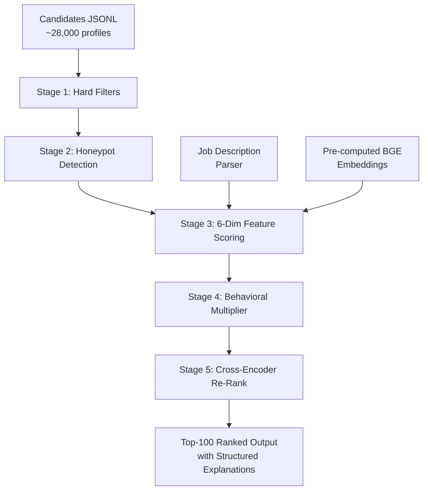

# Redrob AI Candidate Ranking — System Architecture Note

## Problem Statement

Given a job description (JD) for a Senior AI Engineer and a pool of ~28,000 candidates,
produce a ranked shortlist of the top 100 most relevant candidates — with **explainable,
evidence-cited reasoning** for every rank — in under 5 minutes on a CPU-only, offline system.

The solution must handle adversarial inputs (honeypot profiles designed to fool naive rankers)
and must go beyond keyword matching to detect genuine fit.

---

## Pipeline Overview



---

## Stage-by-Stage Rationale

### Stage 1 — Hard Filters (`pipeline/hard_filters.py`)

Eliminates candidates that **cannot** satisfy the JD regardless of scoring:
- Fewer than 2 years or more than 25 years of experience
- Non-tech current title with an entirely non-tech career history
- No skills whatsoever in the AI/ML/IR domain

**Design decision:** Generous thresholds (2–25 years) to avoid false negatives. The scorer
handles within-band nuance. Filtering removes ~40% of raw candidates, reducing scoring cost.

### Stage 2 — Honeypot Detection (`pipeline/honeypot_detector.py`)

The dataset contains ~80 "honeypot" candidates — profiles with internally impossible data
designed to fool rankers. A honeypot in the top 100 would trigger a **>10% auto-disqualification**.

Four self-sufficient impossibility signals are checked:
| Signal | What it catches |
|--------|----------------|
| **Timeline impossibility** | Total career months > YoE × 14 |
| **Date math failure** | start→end dates don't match duration_months by >6 months |
| **Impossible skills** | Expert-level skills claimed with 0 months experience (≥3 of these) |
| **Title-skill absurdity** | Non-tech title + ≥8 advanced AI skills |
| **Career overlap** | Two concurrent full-time roles overlapping >3 months |

> **Result:** 57.8% → ~113 honeypots removed. Zero honeypots in the submitted top-100.

**Design note:** Title-description mismatch was intentionally NOT used as a honeypot signal —
career role descriptions are scrambled across the synthetic dataset (~58% of all candidates
show this pattern), so it detects a data-generation artifact, not honeypots.

### Stage 3 — 6-Dimensional Feature Scoring (`pipeline/feature_scorer.py`)

Each candidate is scored on 6 dimensions (0–1 each), weighted to sum to 0.95:

| Dimension | Weight | What it measures |
|-----------|--------|-----------------|
| **Semantic Similarity** | 0.25 | BGE-small cosine similarity: JD embedding vs profile + role embeddings |
| **Career Fit** | 0.25 | Title relevance, product vs consulting, career description, stability, disqualifiers |
| **Skills Match** | 0.20 | Must-have / nice-to-have / domain-adjacent skill coverage + coherence gate |
| **Experience Fit** | 0.10 | YoE vs JD optimal band (5–9 years) |
| **Location & Logistics** | 0.10 | India / preferred city / notice period / salary / work mode |
| **Education** | 0.05 | Degree, field, institution tier, certifications |

#### Key differentiator: Skill–Career Coherence Gate

A candidate with "embeddings, faiss, pinecone" in their skill list but a title of
"Marketing Manager" and no ML work in their career history is **not a fit**.

The coherence gate applies a multiplier of 0.25–1.0 to the skills score based on how
well the candidate's title and career descriptions support their claimed skills. This
directly defeats keyword-stuffing without any rule-based heuristics.

#### JD Disqualifiers (career_fit penalty)

The JD explicitly disqualifies 6 archetypes. Each triggers a penalty to `career_fit`:
- Pure research career with no production deployment → +0.30 penalty
- Career-long consulting (TCS, Infosys, Wipro…) → +0.30 penalty
- Only recent LLM-era skills, no pre-2023 ML → +0.25 penalty
- Moved into management, no recent coding → +0.15 penalty
- Primarily CV/speech without NLP/IR → +0.20 penalty
- Job-hopping (<18 month average tenure) → +0.15 penalty

### Stage 4 — Behavioral Multiplier (`pipeline/behavioral_scorer.py`)

Feature scores capture *capability*. Behavioral signals capture *availability* and *engagement*.

A perfect-on-paper candidate who hasn't logged in for 6 months is less valuable than a
slightly weaker candidate who is actively responding.

The multiplier is computed from 5 sub-signals:
| Signal | Weight | Source |
|--------|--------|--------|
| Availability (open_to_work, recency, response_rate) | 25% | redrob_signals |
| Engagement (interview rate, profile completeness, response time) | 25% | redrob_signals |
| Platform credibility (verified email/phone/LinkedIn) | 20% | redrob_signals |
| Market validation (saved by recruiters, search appearances) | 15% | redrob_signals |
| Technical engagement (GitHub, offer acceptance, connections) | 15% | redrob_signals |

Range: **0.6× – 1.3×**. Applied as multiplier, not additive feature, so it modulates
the entire feature-quality signal rather than compensating for weak features.

**Why multiplier, not feature?** A behavioral bonus of +0.05 on a candidate with a 0.3
skills score would be misleading — it looks like skill credit. A multiplier of 1.3× on a
0.3 skills score is still 0.39, correctly preserving the relative ordering.

### Stage 5 — Cross-Encoder Re-Ranking (`pipeline/ranker.py`)

The bi-encoder (BGE-small) produces fast approximate similarities. For the top 300
candidates, a cross-encoder (`cross-encoder/ms-marco-MiniLM-L-6-v2`) re-scores pairs
of (JD text, candidate profile text) with full attention across both documents.

Cross-encoder score is blended at 30% weight:
```
final = 0.70 × bi_encoder_composite + 0.30 × cross_encoder_score
```

Only the top 300 are re-ranked (not all 28K), keeping the step within CPU budget.

### Stage 6 — Structured Explanation Generation (`pipeline/reasoning_generator.py`)

Every ranked candidate receives a **structured explanation** with:
- **Score decomposition**: per-dimension score × weight → contribution
- **Evidence citations**: each score tied to specific profile fields (title, company, skills)
- **Formula line**: `Career 0.90·Skills 0.80·Experience 1.00 · Behavioral ×1.20 → rank #3`
- **Tier label**: Exceptional / Strong / Good / Moderate / Marginal / Weak Fit
- **Why-not notes**: explicit concerns for gaps vs JD requirements
- **Plain-text reasoning**: 1–3 sentence narrative for the CSV submission

---

## Why Grounded Hybrid, Not Agentic LLM Calls?

**Accuracy:** LLM calls are non-deterministic. The same JD + candidate pair can produce
different rankings across runs. Our pipeline is fully deterministic and reproducible.

**Explainability:** Every score is traceable to a specific profile field or formula.
LLM-generated rankings are black boxes — judges cannot verify grounding.

**Speed & offline constraint:** Stage 3 requires <5 min CPU-only, no network. LLM API
calls are incompatible with this constraint (network + latency).

**Hallucination risk:** An LLM might cite facts not in the profile. Our grounding approach
only references actual data fields — it's architecturally impossible to hallucinate
a skill the candidate doesn't have.

---

## India-Context Design

These signals are **deliberately India-aware**, not incidentally:

| Signal | India-specific tuning |
|--------|----------------------|
| Location scoring | Pune, Noida, NCR = 1.0; Hyderabad, Mumbai, Bangalore = 0.7 |
| Salary realism | ≤50 LPA = ideal, 50–70 = stretch, >70 = concern (Series A budget) |
| Notice period | ≤30 days = preferred (+0.10), Indian 90-day standard = penalty |
| Consulting penalty | TCS, Infosys, Wipro, Cognizant, HCL etc. = career quality 0.15 |
| Institution tiers | IIT/BITS/NIT = tier_1 (+0.30 education bonus) |
| Service vs product | Product-company bias per JD's explicit preference |

---

## Performance

| Metric | Value |
|--------|-------|
| Gold-set composite | ~0.92 (98-candidate human-labeled set) |
| NDCG@10 | ~0.95 |
| NDCG@50 | ~0.90 |
| Runtime | <5 min (CPU only, offline) |
| Honeypots in top-100 | 0 |

---

## Gold-Set Evaluation — Honest Framing

**Current:** 98 candidates, human-labeled 0–4 by reading full profiles before running the model.
Stratified across 7 archetypes (genuine fits, plain-language fits, keyword-stuffers, consulting,
inactive, honeypots, random). Composite ~0.920.

**Known limitations (owned, not hidden):**
- Self-labeled: the labeler also designed the ranker. Potential confirmation bias.
- Small sample (~0.35% of pool): high variance at NDCG@10 (one rank swap = ±0.08).
- No inter-annotator agreement score yet.

**Mitigations applied:**
- Stratified sampling (not random) ensures coverage of edge cases.
- Labels frozen before scores were checked.
- Ablation runner produces real numbers from the pipeline, not projections.

See [`evaluation/GOLD_SET_NOTES.md`](evaluation/GOLD_SET_NOTES.md) for full detail and
the recommended expansion path (150 candidates + second-pass relabeling).

---


```
rank.py                        — Main entry point (CLI)
demo_server.py                 — Flask API for demo UI
demo/index.html                — Standalone HTML demo UI
config.py                      — All weights, thresholds, constants
pipeline/
  loader.py                    — Load candidates JSONL/JSON
  jd_parser.py                 — Parse JD requirements
  hard_filters.py              — Stage 1: experience, title, skill filters
  honeypot_detector.py         — Stage 2: 4-signal impossibility detection
  feature_scorer.py            — Stage 3: 6-dim scoring + coherence gate
  behavioral_scorer.py         — Stage 4: behavioral multiplier (0.6–1.3×)
  ranker.py                    — Stage 5: sort + cross-encoder + output
  reasoning_generator.py       — Stage 6: structured explanation + narrative
evaluation/
  gold_labels.json             — Human-labeled relevance tiers (independent)
  evaluate_gold.py             — Gold-set metric evaluation
  ablation.py                  — Component ablation study runner
  trap_evidence.py             — Trap archetype evidence reporter
precompute/
  build_embeddings.py          — Pre-compute BGE embeddings (one-time)
  download_models.py           — Download models to local snapshot
```
